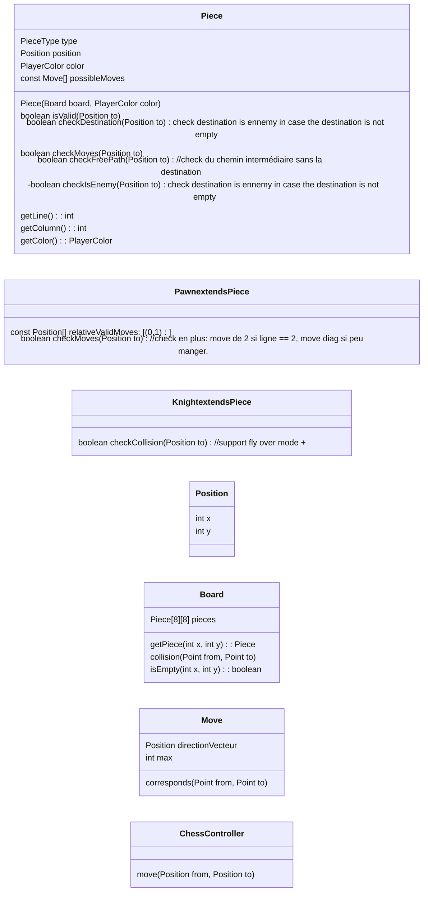

Notes random:
- check du tour
- check des mouvements
- implémenter une interface ChessController (click new game: reset game + init board, move: pos start and end (check si piece existe), start)
- si possible éviter dutiliser piecetype dans la logique. (sauf si on est amené à faire un instanceof).
- aucune pièce est stockée dans l'interface
- mouv: remove pièce départ, put pièce arrivée
- se fait par groupe de 3

Conseils
- Bien organiser le travail
- arriver à factoriser les comportements communs entre pièce
- check des collisions (sauf pour cavalier) commune à toutes les pièces. et check de la trajectoire.

Règles:

Choix d'architectures:
1. Une pièce n'a pas de contexte
1. Une pièce peut déterminer les positions d'arrivée valides
   1. Chaque sous-classe de Pièce a une liste de mouvements relatifs checkés par isValid() dans la super classe.
   1. La rédéfinition de isValid dans chaque sous classe	

Liste des validations du ChessController:
1. Demandes à la pièce si le mouvement est valide
1. Si le mouvement est valide, il faut checker si c'est un cas particulier
   1. Si pas de cas particulier alors le 

TODO: continue la réflexion

idées:

canFlyOver() return true slt si cheval. permet de factoriser dans le controlleur.

cangohorizontal(), cangovertical() utilisé et redéfinit dans les sous classes de Piece. permet à Piece.isValid() de tester ça.

global moves: enum MoveDirection[] = {HORIZ, VERT, DIAG}
precisesMove: {FORWARD}

idée de Camille: faire que le roi hérite de la reine, tout est pareil sauf le max a 1 et la gestion du roque.

Questions:
- dans la méthode checkFreePath dans Pièce, j'ai besoin de créer une liste avec les points intermédiaires entre la position actuelle de la pièce et la position to. Je l'ai implémenté dans checkFreePath mais peut-être faudrait la mettre dans la classe Move? #V
- dans checkDestination dans Pièce, y a-t-il un comportement différent pour le cavalier? #V

## Notes sur les règles des échecs
Roque:
- Un roque se fait en bougeant de 2 cases le roi à gauche ou à droite, on clique donc sur la position d'arrivée du roi.
- Le petit roque est du côté où de la tour la plus proche du roi.

Conditions pour qu'un roque marche
- il ne faut pas avoir ni la tour ni le roi concernés par le roque qui ont bougé
- le roi ne soit pas en échecs (règle générale)
- les cases traversées par le roi ne doivent pas être menacées par une pièce adverse (2 cases à droite ou à gauche, donc en cas de grand roque la case à coté de la tour peut être menacée)
- que le roi ne se mette pas en échecs en roquant (règle générale)

## Brainstorm move spéciaux

class PawnFirstMove extends Move {
	public boolean corresponds(Point from, Point to) {
		if (super.corresponds(from, to))
			return true;

		// Permet à un pion de faire un saut de 2 au tout début
		if (== 1) {
			return true;
		}
	}
}

new PawnFirstMove(new Point(0,2), 1);

## A noter dans le rapport
- notre validation si le chemin est libre ne fonctionne que pour 

New strategy:
1. avoir des sous classes de Move pour les move particuliers qui font les changements sur le board
1. isvalid-> getValidMove retourne le movement valide à effectuer (sur lequel appeler applyBoardChanges).
1. Checkmoves() -> return Move.
1. chessgame et board ne doivent psa connaitre de détails sur l'implémentation des mouveements, juste demander le mouvement valide à effectuer et sil existe alors demander à que les changements soient appliqués sur le board.
1. check du roi en échecs dans piece dans getvalidmove après le check si toutes les autres conditions sont valides.

