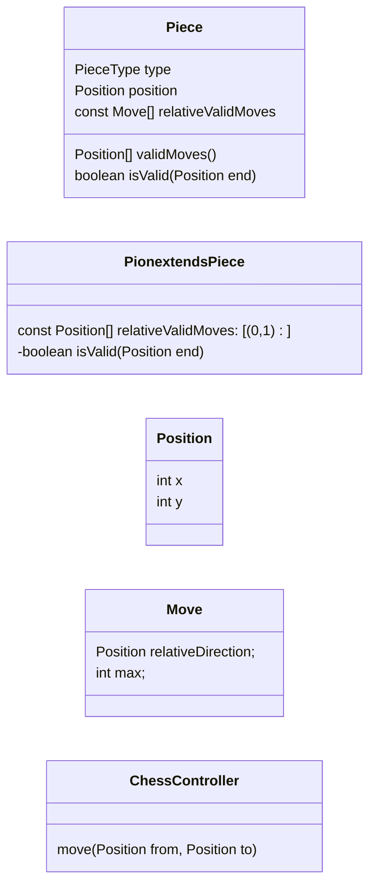

Notes random:
- check du tour
- check des mouvements
- implémenter une interface ChessController (click new game: reset game + init board, move: pos start and end (check si piece existe), start)
- si possible éviter dutiliser piecetype dans la logique. (sauf si on est amené à faire un instanceof).
- aucune pièce est stockée dans l'interface
- mouv: remove pièce départ, put pièce arrivée
- se fait par groupe de 3

Conseils
- Bien organiser le travail
- arriver à factoriser les comportements communs entre pièce
- check des collisions (sauf pour cavalier) commune à toutes les pièces. et check de la trajectoire.

Règles:

Choix d'architectures:
1. Une pièce n'a pas de contexte
1. Une pièce peut déterminer les positions d'arrivée valides
   1. Chaque sous-classe de Pièce a une liste de mouvements relatifs checkés par isValid() dans la super classe.
   1. La rédéfinition de isValid dans chaque sous classe	

Liste des validations du ChessController:
1. Demandes à la pièce si le mouvement est valide
1. Si le mouvement est valide, il faut checker si c'est un cas particulier
   1. Si pas de cas particulier alors le 

TODO: continue la réflexion